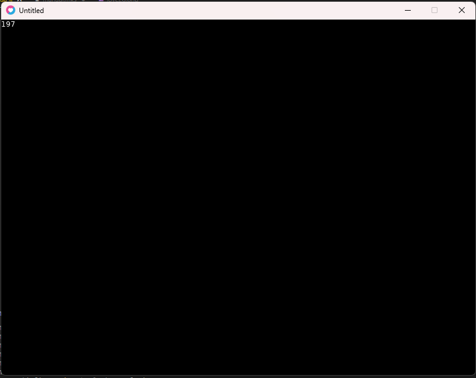
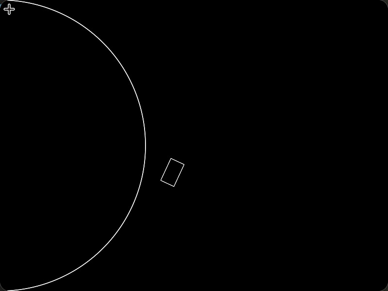
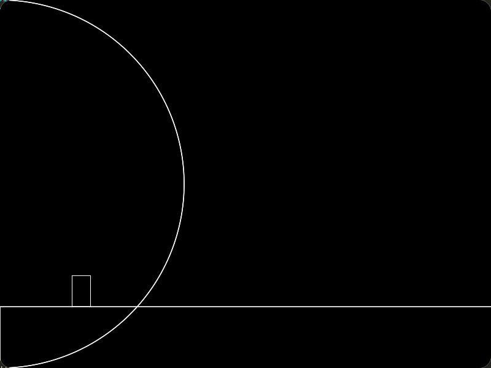
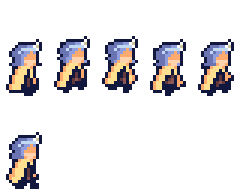

# Programando com Lua e LÖVE Framework


---
**Documentações Úteis:**

1. [Síntaxe Básica da Linguagem Lua.](https://syntaxstation.com/lua.html)
2. [LÖVE Wiki - Documentação do LÖVE.](https://love2d.org/wiki/Main_Page)
3. [Windfield - Documentação e Readme.](https://github.com/a327ex/windfield/blob/master/README.md)
---


###  1. Introdução Básica


    Essa parte do documento serve apenas para dar uma introdução geral à linguagem Lua.
    
    ###  1.1. Variáveis


        Variáveis em Lua são declaradas da seguinte forma:
        ```var = "Olá, Mundo!"```
        A linguagem é **fracamente tipada**, ou seja, não precisamos declarar o tipo de dado, observe:
        ```
        myNum = 100                  --Number
        myOtherNum = 20.18           --Number
        myString = "Hello World!"    --String
        myBool = true                --Boolean
        ```
    
    ###  1.2. Condições


        As condicionais são feitas com a seguinte sintáxe:
        ```
        if myNum == 0 then
            myNum = myNum + 1
        end
        ```
        Também temos o `if-then-else` e o `if-then-elseif-then-else`.
        ```
        if myNum > 1 then
            result = "myNum is greater than 1"
        elseif myNum < 1 then
            result = "myNum is less than 1"
        else
            result = "myNum is equal to 1"
        end
        ```
    
    ###  1.3. Loops


        Lua tem dois tipos de Loops: While e For.
        ```
        while contador <= 5 do
            print(contador)
            contador = contador + 1
        end
        ```
        O `for` já é um pouco mais exótico, tendo uma sintáxe bem diferente da linguagem C, mas ainda seguindo o básico de `variável, limite e step/passo`.
        ```
        for i = 1, 3, 1 do
            print(i)
        end
        ```
    
    ###  1.4. Funções


        As funções em Lua são criadas com a keyword `function`.
        ```
        function increaseX(x)
            return x + 1
        end
        ```
        E as mesmas são instanciadas com:
        ```
        increaseX(10)
        increaseX(var)
        ```
        Podemos também fazer funções em uma única linha assim:
        ```function pow(base, exp) return base^exp end```
    
    ###  1.5. Variáveis Locais


        Variáveis *locais* devem ser *definidas como tal* com a keyword `local`.
        ```
        function foo(x)
            local var = x + 5
            return var / 2
        end
        ```
        Caso contrário, ela será *automaticamente definida como global*.
    

###  2. Tables


    As **Tables** da linguagem Lua são como *arrays*, porém diferentes em vários aspectos. Instanciamos uma table vazia da seguinte maneira:
    ```table = {}```
    E podemos fazer uma **table** com valores do seguinte modo:
    ```table = {10, 20, 30}```
    ###  2.1. Pegando valores de uma Table


        Pegamos um valor de uma table com a seguinte sintaxe:
        ```table[2] -- Retorna 20```
        O motivo do retorno ser 20 e não 30 se dá ao fato que em Lua o índice das Tables começam em 1, e não em 0.
    


    ###  2.2. Inserindo valores em uma Table


        Podemos inserir valores na nossa table de variadas formas. A mais comum é usando a função `table.insert()`:
        ```table.insert(table, 50)```
        Porém, podemos também usar **chaves** nas tables, além de **propriedades**, tornando-os algo similar aos JSONs.
        ```
        table["nome"] = "João"                -- Exemplo com chaves
        table.profissão = "Professor"         -- Exemplo de propriedade
        ```
        No caso das **propriedades**, é possível associar inclusive funções à elas. Observe o exemplo:
        ```
        -- Declarando uma função:

        function andar(x, y)
            print("Andando para as coordenadas:", x, y)
        end

        -- Criando uma table e uma propriedade:

        pessoa = {}
        pessoa.andar = andar
        
        -- Chamando a função:

        pessoa.andar(10, 20) -- Saída: "Andando para as coordenadas: 10 20"
        ```

        ###  2.2.1. Usando Tables como Objetos


            Usando as **propriedades** podemos usar tables essencialmente como objetos, atribuindo funções e propriedades à elas. Veja o exemplo:
            ```
            -- Criando um objeto:

            pessoa = {}

            -- Adicionando propriedades:

            pessoa.nome = "João"
            pessoa.idade = 30

            -- Adicionando funções:

            function pessoa.andar(x, y)
                print("Andando para as coordenadas:", x, y)
            end

            -- Chamando a função:

            pessoa.andar(10, 20) -- Saída: "Andando para as coordenadas: 10 20"
            ```
            Isso será útil para a criação de jogos com o LOVE, onde podemos criar objetos para os personagens, inimigos, etc. de forma mais organizada.
        
    
    ###  2.3. Iterando por tables


        Podemos iterar por uma table e seus valores usando o loop `for-in` com a função `ipairs()`:
        ```
        for index, value in ipairs(table) do
            print(index)
            print(value)
        end
        ```
    
    ###  2.4. Tables Aninhadas


        Podemos ter tables dentro de tables, tornando-as aninhadas. Veja o exemplo:
        ```
        table = {
            {10, 20, 30},
            {40, 50, 60},
            {70, 80, 90}
        }
        ```
        Para acessar um valor de uma table aninhada, fazemos:
        ```table[2][3] -- Retorna 60```
    

---
###  3. Usando LÖVE


LÖVE é um framework para a criação de jogos 2D em Lua. Ele fornece uma série de ferramentas e funções que facilitam o desenvolvimento de jogos, como manipulação de gráficos, áudio, física e entrada do usuário.

    ###  3.1. Instalando LÖVE


        Para começar a usar o LÖVE, você precisa instalá-lo no seu sistema. Você pode baixar a versão mais recente do site oficial: [](https://love2d.org/).
        Após a instalação, você pode verificar se tudo está funcionando corretamente executando o comando:
        ```love --version```
    
    ###  3.2. Estrutura Básica de um Projeto LÖVE


        Um projeto LÖVE geralmente consiste em um arquivo principal chamado *main.lua* e outros arquivos Lua e recursos (imagens, sons, etc.) necessários para o jogo. O arquivo *main.lua* deve conter pelo menos três funções principais:
        ```
        function love.load()
            -- Inicialização do jogo
        end

        function love.update(dt)
            -- Atualização do estado do jogo a cada frame.
        end

        function love.draw()
            -- Desenho de gráficos na tela a cada frame.
        end
        ```
        Podemos ver melhor como essas funções funcionam com o seguinte exemplo usando `number`:
        ```
        function love.load()
            number = 0
        end

        function love.update(dt)
            number = number + 1
        end

        function love.draw()
            love.graphics.print(number)
        end
        ```

        Note que ao executarmos isso, nosso "jogo" irá mostrar a variável number crescendo de 0 à infinito a cada frame.
        

        ###  3.3. Desenhando Gráficos


        Vamos iniciar com elementos simples para serem desenhados em nossa tela. Usaremos a função `love.draw()` e vamos desenhar um simples retângulo com a função `love.graphics.rectangle()`, ela recebe uma série de parâmetros, sendo eles `mode, x, y, width e height`:
        ```
        function love.draw()
            -- mode pode ser "fill" ou "line"
            love.graphics.rectangle("fill", 0, 0, 100, 200)
        end
        ```
        Com isso, temos um retângulo em nosso jogo, veja:
        
        Com isso, temos a base para começar a criar nossos jogos com o LÖVE. No proximo capitulo iremos começar a desenvolver um jogo de plataforma.
        
    


###  4. Desenvolvendo um jogo de plataforma com LOVE


    Para iniciarmos o desenvolvimento de um jogo de plataforma usando o LOVE, precisamos primeiro nos preocupar com a física do jogo. Por mais que o LOVE tenha um módulo para isso, usaremos uma biblioteca que facilita o processo chamada `windfield`.

    O `windfield` pode ser [baixado aqui.](https://github.com/a327ex/windfield) Após baixar, extraia o arquivo e coloque a pasta *windfield* na pasta do seu projeto dentro de uma pasta chamada *libs*. Feito isso, vamos importar a biblioteca no nosso arquivo *main.lua*:

    ```
    function love.load()
        wf = require 'libs/windfield'
    end
    ```

    O primeiro passo para trabalhar com o windfield é iniciar um mundo físico. Vamos fazer isso no `love.load()`:
    ```
    function love.load()
        wf = require 'libs/windfield'
        world = wf.newWorld(0, 800, true)
    end
    ```

    ###  4.1. Fisica Básica com o Windfield


        O primeiro parâmetro do `newWorld()` é a gravidade, o segundo é a velocidade máxima de um corpo e o terceiro é se o mundo é sleepable ou não. Sleepable significa que os corpos que não estão se movendo não serão atualizados, economizando recursos.

        Agora que temos um mundo físico, vamos criar um corpo para o nosso jogador. Vamos fazer isso no `love.load()`:
        ```
        function love.load()
            wf = require 'libs/windfield'
            world = wf.newWorld(0, 800, true)

            player = world:newRectangleCollider(100, 100, 50, 50)
        end
        ```

        O `newRectangleCollider()` cria um corpo retangular com os parâmetros `x, y, width e height`. Agora que temos um jogador, vamos desenhá-lo na tela. Vamos fazer isso no `love.draw()`:
        ```
        function love.update(dt)
            world:update(dt)
        end

        function love.draw()
            player:draw()
        end
        ```
        O `world:update()` atualiza o mundo físico e o `player:draw()` desenha o jogador na tela.
        No caso, a função `player:draw` não está desenhando o player em sí, mas sim a sua *colisão*.

        Podemos inclusive testar a física utilizando um `platform = newCircleCollider() da seguinte forma:`
        ```
        function love.load()
            wf = require 'libs/windfield'
            world = wf.newWorld(0, 800, true)

            player = world:newRectangleCollider(100, 100, 30, 50)
            player:setType('dynamic')
            platform = world:newCircleCollider(0,300,300)
            platform:setType('static')
        end
        ```

        Aqui, criamos uma plataforma circular e a colocamos no canto inferior esquerdo da tela. O `setType('static')` define que a plataforma é estática, ou seja, não se move. Já `player:setType('dynamic')` define que o jogador é dinâmico, ou seja, ele se move e é afetado pela física. Também temos o `setType('kinetic')` que é um corpo que não é afetado pela gravidade, mas é afetado por colisões.

        

        Vamos adicionar mais um retângulo para, ao invés de nosso "*player*" cair, ele colidir com o retângulo. Vamos fazer isso no `love.load()`:
        ```
        function love.load()
            wf = require 'libs/windfield'
            world = wf.newWorld(0, 400, true)

            player = world:newRectangleCollider(100, 100, 30, 50)
            player:setType('dynamic')
            
            platform = world:newCircleCollider(0,300,300)
            platform:setType('static')

            platform = world:newRectangleCollider(0,300,1300,1500)
            platform:setType('static')
        end
        ```

        
        

    ###  Adicionando Movimentação e Salto


    Vamos fazer com que nosso `player` se mexa e salte de acordo com as setas do teclado. Ao usar o `windfield`, todo objeto possui a propriedade de um:
    
    `body`: que é o corpo físico do objeto.
    `fixture`: que é a colisão do objeto.
    `shape`: que é a forma do objeto.

    Tudo encapsulado em uma única entidade. Ou seja, **todas as funções disponíveis em**`love.Body` estão disponíveis para nosso uso. O mesmo é válido para os outros dois. Caso queiramos fazer nosso `player` pular, por exemplo, podemos usar a função `Body:applyLinearImpulse`.

    Vamos adicionar a seguinte função em nosso `main.lua`:
    ```
    function love.keypressed(key)
        if key == 'up' then
            player:applyLinearImpulse(0, -500)
        end
    end
    ```
    Essa função determina que quando a *setinha do teclado para cima* for apertada, o `player` irá pular. O `applyLinearImpulse` recebe dois parâmetros, `x e y`, que são a força aplicada no corpo. Infelizmente, com isso nosso `player` irá pular infinitamente, vamos corrigir isso posteriormente.

    Por hora, vamos adicionar movimentação ao nosso `player`. Vamos adicionar a seguinte função em nosso `love.update(dt)`:
    ```
    function love.update(dt)
        world:update(dt)

        local px, py = player:getPosition()
    end
    ```
    A função `player:getPosition()` irá adicionar os valores de `x` e `y` da posição do nosso `player` às variáveis `px e py` para que possamos utilizá-las. Vamos adicionar a **propriedade**`player.speed`:

    ```
    function love.load()
        wf = require 'libs/windfield'
        world = wf.newWorld(0, 900, true)

        player = world:newRectangleCollider(100, 100, 30, 50)
        player:setType('dynamic')
        player.speed = 200

        platform = world:newCircleCollider(0,300,300)
        platform:setType('static')

        platform = world:newRectangleCollider(0,500,3000,1200)
        platform:setType('static')
    end
    ```

    E então, em `love.update()`, vamos adicionar o seguinte código:
    ```
    function love.update(dt)
        world:update(dt)

        local px, py = player:getPosition()
        if love.keyboard.isDown('left') then
            player.setX(player, px - player.speed * dt)
        elseif love.keyboard.isDown('right') then
            player.setX(player, px + player.speed * dt)
        end

    end
    ```

    Esse código permite a movimentação do nosso jogador ao apertarmos as setas do teclado, somando ou subtraindo sua velocidade.

    
    ###  Classes de Colisão


    As classes de colisão são uma forma de organizar os objetos em grupos. Por exemplo, podemos ter uma classe de colisão chamada *player* para o nosso jogador e uma classe de colisão chamada *platform* para as plataformas. Vamos adicionar classes de colisão ao nosso jogo.

    Vamos adicionar a seguinte função em nosso `love.load()`:
    ```
        world:addCollisionClass('Player')
        world:addCollisionClass('Platform')
    ```
    Para associarmos um objeto à sua nova classe, adicionamos o parâmetro da seguinte forma em nosso `love.load()`:
    ```
        player = world:newRectangleCollider(100, 100, 30, 50, {collision_class = 'Player'})

        circle = world:newCircleCollider(0, 300, 300, {collision_class = 'Platform'})
        platform = world:newRectangleCollider(0, 500, 3000, 1200, {collision_class = 'Platform'})
    ```

    Para fazermos um teste, vamos declarar que `circle` faz parte de uma `collision_class` que não interage com o jogador. Vamos adicionar a seguinte função em nosso `love.load()`:
    ```
    world:addCollisionClass('Non-collide')
    circle = world:newCircleCollider(0, 300, 300, {collision_class = 'Non-collide'})
    circle:setType('static')
    ```

    Aqui definimos uma nova `collision_class` chamada `Non-collide`. Agora podemos fazer a seguinte alteração na definição da Collision Class do nosso jogador:
    ```
    world:addCollisionClass('Player', {ignores={'Non-collide'}})
    ```

    Assim, resultando em o `player` não colidindo com objetos dessa classe:
    
    

    ###  4.2. Ajustando Player para não ser afetado


    Atualmente nosso `player` é afetado até demais pela gravidade e acaba caindo com frequencia. Para corrigir isso, podemos adicionar uma nova propriedade a ele chamada de `setFixedRotation()`:
    ```player:setFixedRotation(true)```
    Isso fará com que nosso jogador não rode e seja afetado por outras colisões.
    

    ###  4.3. Adicionando colisões de dano


    Agora que temos as Collision Classes, podemos fazer uma nova colisão de dano. Primeiro vamos adicionar uma nova classe e um novo objeto em `love.load()`:
    ```
    danger = world:newRectangleCollider(500, 400, 100, 100, {collision_class = 'Danger'})
    danger:setType('dynamic')
    ```

    E então, dentro do nosso `love.update()`, vamos adicionar:
    ```
    function love.update(dt)
        world:update(dt)

        if player.body then
            local px, py = player:getPosition()
            if love.keyboard.isDown('left') then
                player.setX(player, px - player.speed * dt)
            elseif love.keyboard.isDown('right') then
                player.setX(player, px + player.speed * dt)
            end

            if player:enter('Danger') then
                player:destroy()
            end
        end
    end
    ```
    
    ###  Fazendo o jogador pular


    Para fazermos o jogador pular, adicionamos a seguinte linha de código em nosso `love.keypressed()`:
    ```
    function love.keypressed(key)
        if player.body then
            if key == 'up' then
                local colliders = world:queryRectangleArea(player:getX() - 15, player:getY() + 25, 30, 5, {'Platform', 'Danger'})
                if #colliders > 0 then
                    player:applyLinearImpulse(0, -800)
                end
            end
        end
    end
    ```
    Se a tecla pressionada for a tecla `'up' (para cima)`, a função realiza uma consulta na área retangular abaixo do jogador, usando `world:queryRectangleArea`. Esta consulta verifica se há algum objeto das classes **'Platform' ou 'Danger'** dentro da área especificada.
    
    Se houver pelo menos um objeto na área, o jogador recebe um impulso linear para cima, simulando um salto, através do método `player:applyLinearImpulse(0, -800)`.

    Com base nisso, agora é impossível para o jogador pular infinitas vezes, pois ele só pode pular se estiver em contato com uma plataforma ou um objeto de perigo.
    
    ###  4.4. Adicionando gráficos e Animação


    Primeiramente, é necessário termos uma *sheet* de sprites para animarmos e usarmos. Em nosso caso, usaremos o spritesheet da **Cruz**:
    
    
    Para simplificar esse processo, iremos usar a biblioteca **anim8** para lidar com a animação. Primeiramente, baixe a biblioteca [ aqui.](https://github.com/kikito/anim8) Após baixar, extraia o arquivo e coloque a pasta *anim8* na pasta do seu projeto dentro de uma pasta chamada *libs*. Feito isso, vamos importar a biblioteca no nosso arquivo *main.lua* em `love.load()`:
    ```
        anim8 = require 'libs/anim8/anim8'

        -- Criando uma nova table "sprites".
        sprites = {}
        sprites.player = love.graphics.newImage('caminho/para/spritesheet')
    ```
    Agora, devemos montar uma grade no qual o sprite será dividido. Isso pode ser feito com o seguinte código:
    ```
        -- Note que o calculo dos dois primeiros parâmetros são o tamanho da imagem divido pela
        -- quantidade de sprites.

        local grid = anim8.newGrid(48, 96, sprites.player:getWidth(), sprites.player:getHeight())
    ```
    Agora, vamos criar as animações para o nosso jogador:
    ```
        -- A animação é criada com o grid e a sequência de quadros.
        animations = {}
        animations.idle = anim8.newAnimation(grid('1-1', 1), 0.1)
        animations.run =  anim8.newAnimation(grid('1-5', 1), 0.1)
    ```
    Com isso pronto, podemos adicionar a seguinte função em nosso `love.draw()`:
    ```
        function love.draw()
            if player.body then
                local px, py = player:getPosition()
                player.animation:draw(sprites.player, px, py) -- Pode ser necessário ajustar a posição.
            end

            world:draw()
        end
    ```

    Agora, para animar o jogador, vamos atualizar nosso `love.update()` da seguinte maneira:

    ```
    function love.update(dt)
        world:update(dt)

        if player.body then
            local px, py = player:getPosition()

            if love.keyboard.isDown('left') then
                player.animation = animations.run
                player.setX(player, px - player.speed * dt)

            elseif love.keyboard.isDown('right') then
                player.animation = animations.run
                player.setX(player, px + player.speed * dt)

            else
                player.animation = animations.idle

            end

            if player:enter('Danger') then
                player:destroy()
            end
        end

        player.animation:update(dt)
    end
    ```
    Isso irá alterar a animação do jogador de acordo com a direção que ele está se movendo. Se ele estiver parado, a animação será a de *idle*, e se ele estiver se movendo, a animação será a de *run*. 

    Por fim, vamos inverter a imagem do jogador quando ele estiver indo para a esquerda. Para isso, vamos adicionar a seguinte linha de código em nosso `love.draw()`, mas antes, vamos adicionar uma nova **propriedade** ao player:
    ```
        player.direction = 1 -- 1 para direita, -1 para esquerda.
    ```

    E então adicionamos a seguinte linha de código em nosso `love.update()`:
    ```
    function love.update(dt)
        world:update(dt)

        if player.body then
            local px, py = player:getPosition()

            if love.keyboard.isDown('left') then
                player.animation = animations.run
                player.direction = -1
                player.setX(player, px - player.speed * dt)

            elseif love.keyboard.isDown('right') then
                player.animation = animations.run
                player.direction = 1
                player.setX(player, px + player.speed * dt)

            else
                player.animation = animations.idle

            end

            if player:enter('Danger') then
                player:destroy()
            end
        end

        player.animation:update(dt)
    end
    ```
    O uso de 1 e -1 é intencional, já que isso permite com que alteremos apenas um único valor em nosso `love.draw()`:
    ```player.animation:draw(sprites.player, px - 25, py - 70, nil, 1 * player.direction, 1)```

    Caso tenhamos problema com o sprite saindo do lugar, podemos ajustar isso com um offset:
    ```
        local px, py = player:getPosition()
        local scaleX = 1 * player.direction
        local offsetX = player.direction == 1 and -25 or 25
        player.animation:draw(sprites.player, px + offsetX, py - 70, nil, scaleX, 1)    
    ```
    

    ###  Fazendo Níveis com o Tiled


    O [Tiled](mapeditor.org) é um "editor de níveis" que permite criar mapas de forma simples e eficiente. Para usá-lo, basta baixar o programa e executá-lo.

    Para criar um novo mapa, clique em *File > New > New Map* e escolhemos alguns aspectos do mapa. A orientação deve ser *Orthogonal*, o formato *CSV* e a ordem *Right Down*. O tamanho do mapa pode ser ajustado de acordo com a necessidade, por hora, além da dimensão dos tiles. No nosso caso, nossos tiles são 16x16.

    Devemos fazer o tamanho do mapa ser o tamanho do nosso jogo, então, no nosso caso, 800x600. Para adicionar um tileset, clique em *Map > New Tileset* e selecione o arquivo de tileset que você deseja usar. No nosso caso, usaremos o seguinte Tileset de teste.

    

    Após fazermos nosso mapa, exportamos ele como um `arquivo .lua` e salvamos ele na pasta `maps` no codigo fonte do nosso jogo. Agora para implementarmos o mapa no nosso jogo, vamos instalar a biblioteca **STI** para lidar com o Tiled. Primeiramente, baixe a biblioteca [por aqui](https://github.com/karai17/Simple-Tiled-Implementation).

    Após isso, adicionamos a biblioteca no nosso `love.load()`:
    ```sti = require 'libs/sti/sti'```
    E então criamos uma nova função em nosso `main.lua`:
    ```
    function loadMap()
        gameMap = sti.new('src/maps/level1.lua')
    end
    ```

    Após isso, atualizamos nosso `love.update()` e nosso `love.draw()` da seguinte maneira:

    ```
    function love.update(dt)
        playerUpdate(dt)
        gameMap:update(dt)
        world:update(dt)
    end

    function love.draw()
        drawPlayer()
        -- Aqui vai depender do nome que demos pela camada do Tiled.
        gameMap:drawLayer(gameMap.layers["Foreground"])
        world:draw()
    end
    ```
    Com isso, nossos tiles já estarão visiveis. Porém eles estarão sem colisão. Podemos fazer isso no Tiled, criando uma Object Layer e adicionando as seguintes funções em nosso código:

    ```
    -- Em platforms.lua
    function platforms.spawnCollisions(world, x, y, width, height)
        if width > 0 and height > 0 then
            local platform = world:newRectangleCollider(x, y, width, height, {collision_class = 'Platform'})
            platform:setType('static')
            table.insert(platforms, platform)
        end
    end

    -- Em main.lua
    function loadMap()
        gameMap = sti('src/maps/level1.lua')
        for i, obj in pairs(gameMap.layers["Collision"].objects) do
            platforms.spawnCollisions(world, obj.x, obj.y, obj.width, obj.height)
        end
    end
    ```
    Assim, nossas colisões definidas na camada Object chamada "Collision" do Tiled serão adicionadas ao nosso jogo.
    
    ###  Implementando uma Câmera


    Existe uma biblioteca chamada [HUMP](https://github.com/vrld/hump) que nos permite criar uma câmera para o nosso jogo. Primeiramente, baixe a biblioteca e adicione ela ao seu projeto. Após isso, adicione a biblioteca no seu `love.load()`:
    ```
    cameraFile = require 'libs/hump/camera'
    camera = cameraFile()
    ```
    E então, adicione a seguinte função em seu `love.update()`:
    ```
    camera:lookAt(player.body:getX(), player.body:getY())
    ```

